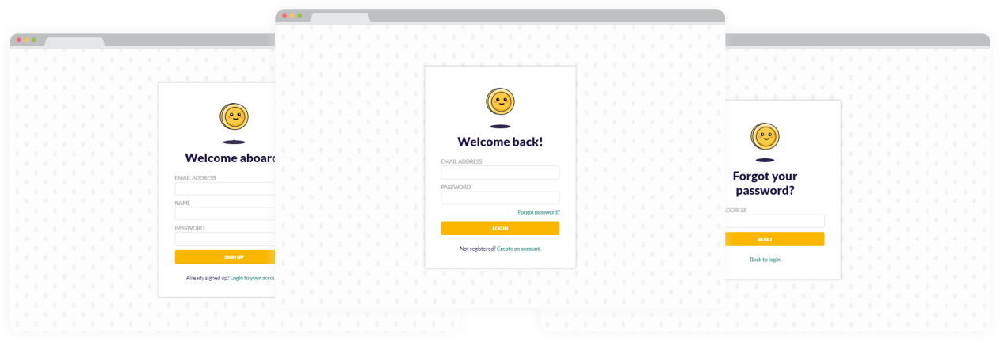

<p align="center" color="#170C3A" style="font-size: 32px; font-weight: bold">
<br/>
Lunch Money!
</p>

## Sobre
Aplicação que simula rotas de autenticação no frontend com uma fake API Rest no backend para uma utilização mais real.

### Principais Rotas
- Login        `/login`
- Cadastro     `/register`
- Mudar senha  `/resset`

## Tecnologias
Criado com:
- [x] **ReactJS** 
- [x] **JSON Server**

## Resultados
<p align="center"></p>

## Execute a aplicação
### Back-end
```sh
#Instale o JSON Server
$ npm install -g json-server

#Inicie a API
$ cd backend
$ json-server --watch db.json
```
### Front-end
```sh
#Instale as dependências
$ cd frontend
$ npm install

#Inicie a aplicação
$ npm start
```
A aplicação vai está rodando em [http://localhost:3000](http://localhost:3000)

## License
Esse projeto está sob a licença MIT. Veja o arquivo [LICENSE](https://github.com/iranadryan/lunch-money-login/blob/master/LICENSE) para mais detalhes.